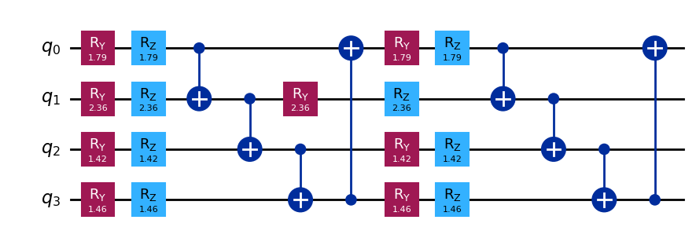

# Hybrid Quantum-Classical Battery Stability Prediction

## Overview
This project is a notebook-based hybrid quantum-classical machine learning experiment for ranking lithium-ion battery materials by predicted stability. It uses classical material descriptors from a battery dataset, compresses them into a smaller feature set, converts those compressed features into quantum-derived signals using a simulated quantum circuit, and then compares a classical baseline model against a hybrid quantum-classical regression workflow.

The final goal is to identify promising battery material candidates with low predicted `E Above Hull (eV)`, which the notebook treats as an indicator of stronger material stability.

## Problem Statement
Battery materials discovery involves evaluating many candidate compounds using physical and chemical descriptors. This project tries to predict the stability score of lithium-ion battery materials and rank chemical formulas based on that predicted score.

## Why Quantum Computing Here?
Quantum methods are used here in a **student-level exploratory way**, not to claim a quantum advantage. The notebook uses quantum circuits to encode compressed material features into quantum-derived numerical signals such as state probabilities and expectation values. Those signals are then fed into a classical regressor.

In other words, the project uses quantum computing here to explore:
- feature encoding with qubits
- simulator-based quantum feature generation
- comparison between a strong classical baseline and a hybrid quantum-classical pipeline

## Core Quantum Concepts Used
- **Qubits**: the compressed feature set is mapped onto a 4-qubit circuit
- **Quantum gates**: `RX`, `RY`, `RZ`, and `CX` gates are used
- **Circuit construction**: each sample is encoded into a repeated rotation-plus-entanglement circuit
- **Entanglement**: CNOT gates are applied in a ring pattern
- **Statevector simulation**: the notebook uses Qiskit `Statevector` instead of real quantum hardware
- **Measurement-derived features**: basis-state probabilities, `Z` expectations, and nearest-neighbour `ZZ` correlations are extracted as numerical features
- **Hybrid quantum-classical workflow**: quantum-derived features are used as input to a classical regression model

## Approach / Workflow
The notebook follows this pipeline:

1. **Load the dataset**
   - Reads `lithium-ion batteries.csv`
   - Preserves the chemical formula for final ranking

2. **Classical preprocessing**
   - Drops identifier columns such as `Materials Id`
   - Converts boolean values to numeric form
   - Engineers additional material features
   - One-hot encodes categorical columns like `Spacegroup` and `Crystal System`
   - Splits data into train and test sets
   - Scales features using `MinMaxScaler`

3. **Classical baseline**
   - Trains an `XGBRegressor` directly on the engineered feature set
   - Evaluates the baseline using RMSE and R²

4. **Quantum preparation**
   - Reduces the scaled feature space to 4 components using PCA
   - Rescales the PCA outputs for circuit encoding

5. **Quantum feature encoding**
   - Encodes each 4-dimensional sample into a 4-qubit circuit
   - Uses repeated `RY` and `RZ` rotations plus ring entanglement
   - Simulates the circuit with `Statevector.from_instruction(...)`
   - Extracts quantum-derived features:
     - basis-state probabilities
     - single-qubit `Z` expectations
     - nearest-neighbour `ZZ` correlations

6. **Hybrid regression**
   - Trains a `GradientBoostingRegressor` on the quantum-derived feature matrix
   - Compares hybrid performance against the classical baseline

7. **Candidate ranking**
   - Selects the better of the two models based on RMSE
   - Ranks chemical formulas by predicted stability score
   - Displays the top candidate from the held-out test set

## Key Features
- Notebook-based end-to-end workflow
- Material descriptor preprocessing and feature engineering
- Classical baseline using XGBoost
- PCA-based feature compression for quantum encoding
- 4-qubit quantum circuit feature encoding with Qiskit
- Statevector-based quantum simulation
- Hybrid regression on quantum-derived features
- Final ranking of candidate chemical formulas

## Tech Stack
- Python
- Jupyter Notebook
- NumPy
- Pandas
- scikit-learn
- XGBoost
- Qiskit
- Matplotlib

## Project Structure
```text
hybrid-quantum-battery-stability-prediction/
├── data/
│   └── lithium-ion batteries.csv
├── notebooks/
│   └── Quantum_Battery_Stability_Notebook.ipynb
├── outputs/
│   └── sample_quantum_circuit.png
├── .gitignore
├── README.md
└── requirements.txt
```

## How to Run
### 1. Create and activate a Python environment
```bash
python3 -m venv .venv
source .venv/bin/activate
```

### 2. Install dependencies
```bash
pip install -r requirements.txt
```

### 3. Open the notebook
```bash
jupyter notebook notebooks/Quantum_Battery_Stability_Notebook.ipynb
```

### 4. Run the notebook cells in order
The notebook is self-contained once the dataset file in `data/` is available.

## Dataset / Input
- Input file: `data/lithium-ion batteries.csv`
- Dataset size: **339 rows x 11 columns**
- The notebook describes this as a lithium-ion battery dataset and preserves:
  - `Formula`
  - `Formation Energy (eV)`
  - `E Above Hull (eV)`
  - `Band Gap (eV)`
  - `Density (gm/cc)`
  - `Volume`
  - `Crystal System`
  - and other related material descriptors

The target variable is:
- `E Above Hull (eV)`

Lower values are treated in the notebook as better stability scores.

## Output / Results
The notebook includes actual saved results, and those results were also reproduced in a fresh execution during verification.

### Reported model comparison
- **Classical baseline**
  - RMSE: `0.023174`
  - R²: `0.453942`
- **Hybrid quantum-classical model**
  - RMSE: `0.024215`
  - R²: `0.403739`

### Model selection used for ranking
Because the classical baseline had the lower RMSE in the saved notebook output, the notebook used the **classical baseline** for final ranking.

### Top candidate shown in the notebook
- **Chemical Formula**: `Li2FeSiO4`
- **Actual Stability Score**: `0.005`
- **Predicted Stability Score**: approximately `0.00310`

This result comes from the notebook's train/test split and ranking logic. It should be treated as a project output for this dataset split, not as a general commercial conclusion.

### Example circuit output
The notebook includes a sample quantum circuit drawing. A saved image extracted from the notebook output is included below:



## What This Project Demonstrates
- How classical material data can be transformed into a quantum-ready feature representation
- How PCA can be used to reduce the input dimension before quantum encoding
- How simulator-based quantum circuits can generate numerical features for classical machine learning
- How to compare a hybrid quantum-classical workflow against a strong classical baseline
- How to interpret quantum computing as an exploratory modeling tool in a materials prediction task

## Current Limitations
- The project uses **simulator-based quantum features only**. No real quantum hardware is used.
- The quantum workflow is **feature encoding plus simulation**, not variational training or a fully quantum model.
- The project is implemented as **one notebook**, not as a modular Python package.
- The included results show that the **classical baseline outperformed the hybrid model** on this test split.
- The dataset is relatively small at 339 rows.
- There are no automated tests.
- The original archive bundled a large `.venv/`, which was removed from the cleaned repository.
- Reproducibility depends on the Python environment. During verification, the notebook ran successfully with `/opt/anaconda3/bin/python3` because the local `python3` inside the extracted project folder pointed to a different interpreter that did not have `xgboost`.

## Future Improvements
- Test additional quantum encoding strategies and compare them systematically.
- Add more notebook cells for visual analysis of model errors and candidate rankings.
- Refactor the notebook into reusable Python modules for preprocessing and quantum feature generation.
- Compare against more classical baselines to better understand where the hybrid approach helps or does not help.
- Try larger or alternative materials datasets for a broader evaluation.
- Add a small reproducibility script or environment file for easier reruns.

## AI Assistance Disclosure
This project was developed as part of academic coursework. AI tools (such as ChatGPT) were used for assistance in structuring, debugging, and documentation. The implementation, logic, and understanding were developed and verified independently.
