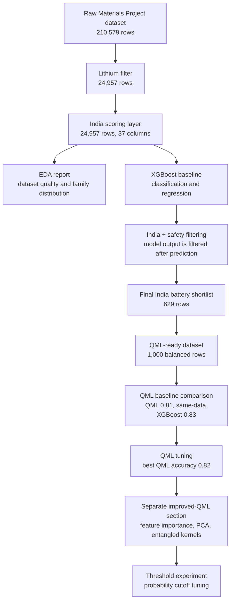

# Project Pipeline Summary

Generated on: 2026-06-28

Project folder: `Summer Vacation`

## Main Problem

Our project problem is:

> Find lithium-ion battery material candidates that are scientifically promising
> and also practical for an India-first battery-material discovery project.

The project does not only ask, "Which material is stable?" It also asks:

- Is the material lithium-based?
- Does it belong to a useful battery family?
- Is it likely to be stable?
- Does it avoid major supply-chain, toxicity, or availability problems?
- Can it be ranked after machine learning prediction for India-focused use?

## Main Data Source

Main dataset:

[Hugging Face Materials Project snapshot](https://huggingface.co/datasets/xpanceo-team/materials-project)

Backup references:

- [Materials Project API docs](https://docs.materialsproject.org/downloading-data/using-the-api/examples)
- [OQMD REST API docs](https://static.oqmd.org/static/docs/restful.html)
- [JARVIS dataset list](https://jarvis-tools.readthedocs.io/en/master/databases.html)

## Overall Pipeline

## Artifact Map

| Stage | Input | Output | Rows | Script | Report |
| --- | --- | --- | --- | --- | --- |
| Raw dataset mirror | Hugging Face parquet files | `data/raw/materials_project_hf/` | 210,579 | Download step | `data/metadata/dataset_summary.md` |
| Lithium filtering | Raw parquet shards | `data/processed/materials_project_lithium.csv` and `.parquet` | 24,957 | `scripts/process_materials_project_dataset.py` | `data/metadata/dataset_summary.md` |
| India scoring | `materials_project_lithium.csv` | `data/processed/lithium india scored.csv` | 24,957 | `scripts/create_lithium_india_scored_dataset.py` | `data/metadata/lithium_india_scored_summary.md` |
| EDA | `lithium india scored.csv` | Analysis report | 24,957 | `scripts/create_lithium_india_scored_eda.py` | `data/metadata/lithium_india_scored_eda.md` |
| XGBoost baseline | `lithium india scored.csv` | Predictions and saved models | 24,957 classification rows; 24,068 regression rows | `scripts/train_xgboost_baseline.py` | `data/metadata/xgboost_baseline_results.md` |
| Final shortlist | `xgboost predictions with india scores.csv` | `data/processed/final india battery shortlist.csv` | 629 | `scripts/create_final_india_battery_shortlist.py` | `data/metadata/final_shortlist_summary.md` |
| QML-ready dataset | `lithium india scored.csv` | `data/processed/qml_ready_lithium_india.csv` | 1,000 | `scripts/create_qml_ready_dataset.py` | `data/metadata/qml_ready_dataset_summary.md` |
| QML baseline | `qml_ready_lithium_india.csv` | `data/processed/qml baseline predictions.csv` | 200 test predictions | `scripts/train_qml_baseline.py` | `data/metadata/qml_baseline_results.md` |
| QML tuning | `qml_ready_lithium_india.csv` | `data/processed/qml tuning results.csv` | 72 experiments | `scripts/tune_qml_baseline.py` | `data/metadata/qml_tuning_results.md` |
| Tuned QML best model | `qml_ready_lithium_india.csv` | `data/processed/qml tuned best predictions.csv` | 200 test predictions | `scripts/tune_qml_baseline.py` | `data/metadata/qml_best_model_summary.md` |
| Improved QML separate section | `lithium india scored.csv` | `data/processed/improved qml feature pca.csv`, `data/processed/improved qml tuning results.csv`, `data/processed/improved qml best predictions.csv`, `data/processed/improved qml threshold results.csv`, and `data/processed/improved qml threshold predictions.csv` | 1,000 PCA rows; 162 experiments; 9 thresholds; 200 test predictions | `scripts/run_improved_qml_experiments.py` | `data/metadata/improved_qml_section_summary.md` |

## Dataset Sizes

| Dataset | Rows | Columns | Notes |
| --- | ---: | ---: | --- |
| Full raw Materials Project snapshot | 210,579 | Raw source columns | Full public mirror kept in parquet format. |
| Lithium-only dataset | 24,957 | Core modeling columns | Filtered by exact element parsing for `Li`. |
| Lithium India scored dataset | 24,957 | 37 | Adds battery-family and India-feasibility columns. |
| XGBoost classification dataset | 24,957 | 42 encoded features | Target is `is_stable`. |
| XGBoost regression dataset | 24,068 | 42 encoded features | Target is `energy_above_hull`; rows with missing target are removed. |
| Final India battery shortlist | 629 | Shortlist columns | Used for human review and candidate selection. |
| QML-ready balanced dataset | 1,000 | 27 | Balanced 500 stable and 500 unstable rows. |
| QML baseline prediction file | 200 | 11 | Test-set QML and same-data XGBoost predictions. |
| QML tuning results | 72 | 12 | Hyperparameter search results. |
| Tuned QML prediction file | 200 | 8 | Test-set predictions from the best tuned QML model. |
| Improved QML PCA dataset | 1,000 | 14 | Separate feature-importance and PCA dataset. |
| Improved QML tuning results | 162 | 13 | Product and entangled kernel hyperparameter search results. |
| Improved QML prediction file | 200 | 8 | Test-set predictions from the best improved-QML model. |
| Improved QML threshold results | 9 | 5 | Cross-validation results for stable-probability cutoffs. |
| Improved QML threshold prediction file | 200 | 9 | Test-set predictions after threshold-based probability prediction. |

## Key Columns Used

| Column | Role In Project |
| --- | --- |
| `material_id` | Unique material identifier from Materials Project. |
| `formula` | Chemical formula; used for lithium filtering and element parsing. |
| `space_group_number` | Crystal symmetry feature for ML. |
| `crystal_system` | Crystal structure category used as a categorical ML feature. |
| `formation_energy_per_atom` | Formation-energy property useful for stability analysis. |
| `energy_above_hull` | Main thermodynamic stability value; lower is usually better. |
| `is_stable` | Main classification target for the baseline model. |
| `band_gap` | Electronic property used as an ML feature. |
| `is_metal` | Conductivity-related feature. |
| `theoretical` | Marks theoretical entries. |
| `deprecated` | Marks entries that should be lower priority. |
| `battery_family` | Rule-based chemistry family such as LFP, LMFP, LMO, LTO, silicon, carbon, or sulfide. |
| `india_feasibility_score` | India-focused screening score from 0 to 100. |
| `india_decision_label` | Rule label: Recommend, Research Candidate, Caution, or Avoid / Benchmark. |
| `predicted_stable_probability` | XGBoost probability that a material is stable. |
| `predicted_energy_above_hull` | XGBoost predicted energy above hull. |
| `predicted_energy_above_hull_clipped` | Non-negative version used in final filtering. |
| `shortlist_rule_type` | Explains whether the row passed strict model rules or benchmark-family exception rules. |
| `target_is_stable` | QML target column: 1 means stable and 0 means unstable. |
| `qml_predicted_label` | QML model predicted class for the test row. |
| `qml_stable_probability` | QML model probability score for stable class. |
| `xgboost_same_data_predicted_label` | Same-split XGBoost predicted class for comparison. |
| `improved_pca_1` to `improved_pca_8` | PCA features created for the separate improved-QML experiment. |
| `improved_qml_predicted_label` | Predicted stable or unstable class from the best improved-QML model. |
| `improved_qml_stable_probability` | Stable-class probability from the best improved-QML model. |
| `threshold_qml_predicted_label` | Predicted stable or unstable class after probability-threshold tuning. |
| `threshold_qml_stable_probability` | Stable-class probability used for threshold-based prediction. |
| `selected_stable_threshold` | Stable-probability cutoff selected by cross-validation. |

## Methodology Decisions

### 1. Train First, Filter Later

We chose this approach:

1. Train the model on all lithium material families.
2. Predict stability and energy above hull.
3. Apply India feasibility and safety filters after prediction.

Reason:

If we filter too early, the model sees a smaller and biased dataset. Training on
all lithium materials gives the model more examples and keeps the India filter
as a project decision layer, not as a training limitation.

### 2. XGBoost As The Classical Baseline

We selected XGBoost because the project data is tabular:

- Numeric columns such as `band_gap`, `space_group_number`, and `number_of_elements`
- Boolean columns such as `has_fe`, `has_p`, `has_mn`, and `has_co`
- Categorical columns such as `crystal_system` and `battery_family`

XGBoost is a strong baseline for this type of data and is easier to explain
than a very complex deep learning model.

### 3. India Columns Are Not Used For Training

The model does not train on:

- `india_feasibility_score`
- `india_decision_label`
- India rule labels

Reason:

Those columns are our project decision rules. If the model trains on them, it
will learn our hand-made rules instead of learning material-property patterns.

### 4. Leakage Control

For classification:

- Target: `is_stable`
- `energy_above_hull` is not used as a training feature.

For regression:

- Target: `energy_above_hull`
- `is_stable` is not used as a training feature.

Reason:

This avoids giving the model direct answers during training.

### 5. Benchmark Family Exception

The final shortlist has two entry routes:

| Route | Meaning |
| --- | --- |
| Strict model shortlist | Material passes the model probability, hull, India score, family, and safety filters. |
| Benchmark family exception | LFP and LMFP materials are kept when India score and predicted hull are strong, even if the classifier is conservative. |

Reason:

LFP and LMFP are important India-relevant battery families. The classifier was
too conservative for many of these rows, so the final shortlist keeps them as
benchmark-family candidates when their rule-based evidence is strong.

## EDA Findings

From `data/metadata/lithium_india_scored_eda.md`:

- Total lithium rows: 24,957
- Stable rows: 4,052
- Unstable rows: 20,905
- Rows available for full numeric target modeling: 24,068
- Missing values:
  - `formation_energy_per_atom`: 889
  - `energy_above_hull`: 889
  - `band_gap`: 889

Main family distribution:

| Battery Family | Rows |
| --- | ---: |
| Other lithium material | 14,027 |
| LCO-family | 3,541 |
| LMO-family | 3,394 |
| LTO-family | 964 |
| Li-S or sulfide-family | 892 |
| Silicon-family | 852 |
| LFP-family | 735 |
| Carbon-family | 477 |
| LMFP-family | 61 |
| NMC-family | 11 |
| LLZO-family | 3 |

## XGBoost Baseline Results

From `data/metadata/xgboost_baseline_results.md`:

### Classification

Target: `is_stable`

Model: `XGBClassifier`

| Metric | Value |
| --- | ---: |
| Accuracy | 0.9091 |
| Stable precision | 0.73 |
| Stable recall | 0.70 |
| Stable F1-score | 0.71 |

### Regression

Target: `energy_above_hull`

Model: `XGBRegressor`

| Metric | Value |
| --- | ---: |
| Mean absolute error | 0.1005 |
| Root mean squared error | 0.3221 |
| R2 score | 0.3685 |

Interpretation:

The classifier is a useful baseline. The regression model is acceptable for a
first project baseline, but it should be improved later with better features.

## QML Baseline Results

From `data/metadata/qml_baseline_results.md`:

Model: simulated quantum kernel classifier

Input: `data/processed/qml_ready_lithium_india.csv`

Prediction output: `data/processed/qml baseline predictions.csv`

| Model | Dataset | Accuracy | Stable Precision | Stable Recall | Stable F1 |
| --- | --- | ---: | ---: | ---: | ---: |
| QML quantum kernel | QML-ready balanced dataset | 0.8100 | 0.7870 | 0.8500 | 0.8173 |
| XGBoost same QML-ready data | QML-ready balanced dataset | 0.8300 | 0.8367 | 0.8200 | 0.8283 |
| XGBoost full project baseline | Full lithium India-scored dataset | 0.9091 | 0.7300 | 0.7000 | 0.7100 |

QML confusion matrix:

| Actual Class | Predicted Unstable | Predicted Stable |
| --- | ---: | ---: |
| Unstable | 77 | 23 |
| Stable | 15 | 85 |

Interpretation:

The first QML classifier is working. On the same QML-ready test split, XGBoost
is still slightly stronger, but the QML result is close enough to use as a real
baseline for project comparison.

## Tuned QML Results

From `data/metadata/qml_tuning_results.md` and
`data/metadata/qml_best_model_summary.md`:

Search space:

- Feature counts tested: 4, 6, 8, 10
- Angle scales tested: pi/2, pi, 2pi
- SVM `C` values tested: 0.1, 0.5, 1, 2, 5, 10
- Total experiments: 72
- Selection method: 4-fold cross-validation on the train-validation split

Best tuned QML setup:

| Parameter | Value |
| --- | --- |
| Feature count / qubits | 8 |
| Angle scale | pi/2 |
| SVM C | 1.0 |
| Quantum state size | 256 |

Test comparison:

| Model | Test Accuracy | Test Stable F1 |
| --- | ---: | ---: |
| Original QML baseline | 0.8100 | 0.8173 |
| Tuned QML best model | 0.8200 | 0.8269 |
| Same-data XGBoost baseline | 0.8300 | 0.8283 |

Interpretation:

QML tuning improved the QML result, especially stable-class F1. XGBoost remains
slightly ahead on accuracy, but the tuned QML model is now very close on stable
F1.

## Improved QML Separate Section

From `data/metadata/improved_qml_section_summary.md`:

This section is separate from the original QML baseline and the tuned-QML
baseline. It was created to test whether a more advanced preparation route can
improve quantum-kernel behavior.

Method:

- Start again from `data/processed/lithium india scored.csv`.
- Use Random Forest feature importance on the train-validation split only.
- Select the top 16 safe non-leakage features.
- Compress those features into 8 PCA components.
- Test product and entangled quantum-kernel simulations.
- Tune PCA component count, angle scale, kernel type, and SVM `C`.
- Tune the stable-probability threshold as a separate post-model experiment.

Leakage control:

- `energy_above_hull` was not used as a classifier feature.
- `india_feasibility_score` was not used as a classifier feature.
- `india_decision_label` was not used as a classifier feature.

Search space:

| Parameter | Values Tested |
| --- | --- |
| PCA component count | 4, 6, 8 |
| Kernel type | product, entangled_pi_over_2, entangled_pi |
| Angle scale | pi/2, pi, 2pi |
| SVM C | 0.1, 0.5, 1, 2, 5, 10 |
| Total experiments | 162 |

Threshold search:

| Parameter | Values Tested |
| --- | --- |
| Stable-probability threshold | 0.30, 0.35, 0.40, 0.45, 0.50, 0.55, 0.60, 0.65, 0.70 |
| Selection method | 4-fold cross-validation on the train-validation split |
| Best threshold | 0.50 |

Best improved-QML setup:

| Parameter | Value |
| --- | --- |
| PCA components / qubits | 6 |
| Kernel type | entangled_pi |
| Angle scale | pi |
| SVM C | 2.0 |
| Quantum state size | 64 |

Test comparison:

| Model | Test Accuracy | Test Stable F1 |
| --- | ---: | ---: |
| Original QML baseline | 0.8100 | 0.8173 |
| Tuned QML best model | 0.8200 | 0.8269 |
| Improved QML separate section | 0.8150 | 0.8230 |
| Improved QML with threshold tuning | 0.8200 | 0.8269 |
| Same-data XGBoost baseline | 0.8300 | 0.8283 |

Threshold experiment:

| Model | Test Accuracy | Test Stable Precision | Test Stable Recall | Test Stable F1 |
| --- | ---: | ---: | ---: | ---: |
| Improved QML default prediction | 0.8150 | 0.7890 | 0.8600 | 0.8230 |
| Improved QML threshold prediction | 0.8200 | 0.7963 | 0.8600 | 0.8269 |

Interpretation:

The improved-QML section found that the best cross-validation result used an
entangled kernel. Threshold-based prediction improved the improved-QML test
result from 0.8150 accuracy to 0.8200 accuracy and from 0.8230 stable F1 to
0.8269 stable F1. This matches the tuned-QML baseline on stable F1, but XGBoost
still remains slightly ahead overall.

## Final Shortlist Results

From `data/metadata/final_shortlist_summary.md`:

- Input prediction rows: 24,957
- Final shortlist rows: 629
- Rejected rows: 24,328

Final shortlist family counts:

| Battery Family | Count | Percentage |
| --- | ---: | ---: |
| LFP-family | 464 | 73.77 |
| Li-S or sulfide-family | 91 | 14.47 |
| LMFP-family | 48 | 7.63 |
| Silicon-family | 17 | 2.70 |
| Carbon-family | 5 | 0.79 |
| LMO-family | 4 | 0.64 |

Final shortlist label counts:

| India Decision Label | Count |
| --- | ---: |
| Recommend | 469 |
| Research Candidate | 160 |

Rule type counts:

| Shortlist Rule Type | Count |
| --- | ---: |
| Benchmark family exception | 512 |
| Strict model shortlist | 117 |

## Current Project Status

We have completed:

- Downloaded the main large public dataset.
- Created a lithium-only dataset.
- Created an India-scored lithium dataset.
- Added column definitions and project meaning.
- Completed EDA.
- Trained an XGBoost baseline model.
- Created model prediction outputs.
- Created a final India battery shortlist.
- Saved rejected-row audit data for transparency.
- Created a QML-ready balanced dataset with 1,000 rows and 27 columns.
- Created step-by-step QML dataset markdown files for report writing.
- Trained the first simple QML classifier.
- Compared QML with XGBoost on the same QML-ready data.
- Created QML model step markdown files for report writing.
- Tuned QML hyperparameters across 72 combinations.
- Improved QML accuracy from 0.8100 to 0.8200 and stable F1 from 0.8173 to 0.8269.
- Created a separate improved-QML section using feature importance, PCA, and
  entangled-kernel testing.
- Ran 162 improved-QML experiments.
- Best improved-QML test result reached 0.8150 accuracy and 0.8230 stable F1.
- Added a separate threshold experiment for the improved-QML model.
- Threshold-based prediction improved the improved-QML test result to 0.8200
  accuracy and 0.8269 stable F1.

## What We Have Not Done Yet

The project is not finished yet. The next missing parts are:

- Add visual plots for report and presentation.
- Write final academic interpretation of the top materials.
- Try a hardware-oriented QML circuit after the simulated kernel experiments.

## Recommended Next Step

The next best step is:

> Create visual plots and a report-ready comparison section.

Why this should come next:

- XGBoost is already our classical baseline.
- The QML baseline is now trained, tuned, and measured.
- The separate improved-QML section is also complete and documented.
- We now have enough metrics to create comparison charts.
- The final report needs clear visuals for dataset sizes, model metrics, and
  final shortlisted material families.

## Completed QML Dataset Preparation

Created:

`data/processed/qml_ready_lithium_india.csv`

Use a smaller feature set:

| Feature | Reason |
| --- | --- |
| `space_group_number` | Crystal symmetry. |
| `band_gap` | Electronic property. |
| `formation_energy_per_atom` | Stability-related property. |
| `number_of_elements` | Material complexity. |
| `has_fe` | Important for LFP and LMFP. |
| `has_p` | Important for phosphate families. |
| `has_mn` | Important for manganese families. |
| `has_c` | Important for carbon-family materials. |
| `has_si` | Important for silicon-family materials. |
| `has_s` | Important for sulfide and sulfur-family materials. |
| `india_feasibility_score` | Kept for final comparison or ranking, not used as the main scientific target. |

First QML target:

`target_is_stable`

Reason:

Classification is easier to compare clearly:

- XGBoost predicts stable or unstable.
- QML predicts stable or unstable.
- We can compare accuracy, precision, recall, and F1-score.

## Completed QML Model Training

Created:

`data/processed/qml baseline predictions.csv`

Created model reports:

- `data/metadata/qml_baseline_results.md`
- `data/metadata/qml_model_step_01_training_data.md`
- `data/metadata/qml_model_step_02_quantum_kernel.md`
- `data/metadata/qml_model_step_03_qml_results.md`
- `data/metadata/qml_model_step_04_xgboost_comparison.md`
- `data/metadata/qml_model_step_05_interpretation.md`

## Clean Execution Plan For The Next Step

1. Create plots from the existing markdown and CSV outputs.
2. Plot dataset row counts across the pipeline.
3. Plot XGBoost vs QML metrics.
4. Plot final shortlist battery-family counts.
5. Save plots in `data/plots/`.
6. Create a report-ready markdown section using the plot files.

## One-Line Project Story

We are building a pipeline that starts with a large lithium materials database,
learns stability patterns using XGBoost, then filters and ranks the predicted
materials for India-first battery research, then compares the classical
baseline with a simple QML classifier.
